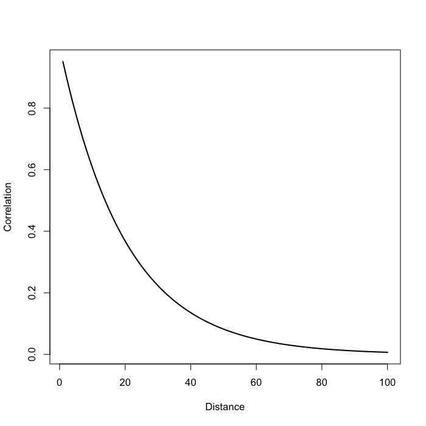
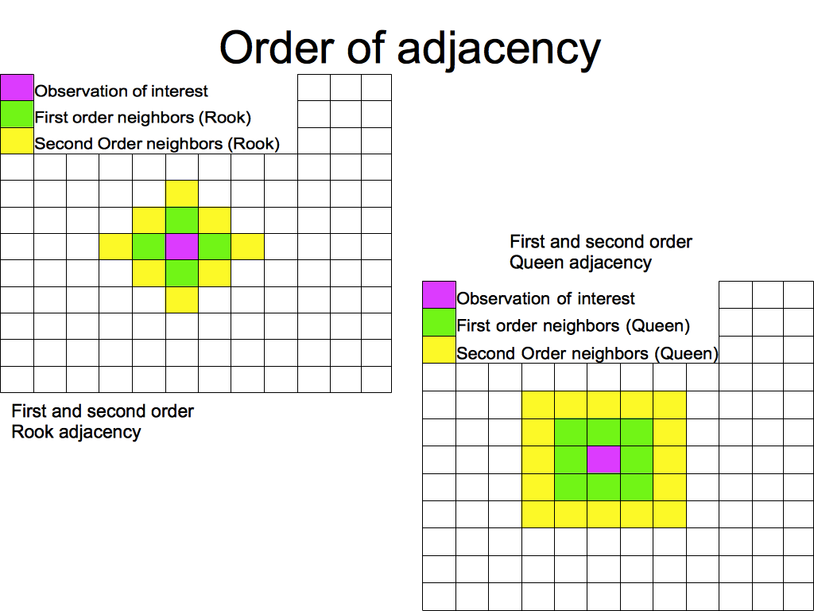
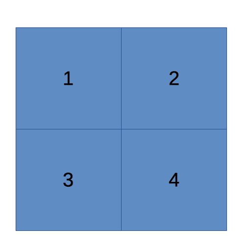

# Lecture Notes - Exploratory Spatial Data Analysis

## What is ESDA 
### Skepticism and openness
In exploratory spatial data analysis (ESDA), we are looking for trends and patterns in data. We are working under the assumption that the more one knows about the data, the more effectively it may be used to develop, test and refine theory. This generally requires we follow two principles:

__Skepticism__: One should be skeptical of measures that summarize data, since they can conceal or misrepresent the most informative aspects of data.


__Openness__: We must be open to patterns in the data that we did not expect to find, because these can often be the most revealing outcomes of the analysis.

We must avoid the temptation to automatically jump to the confirmatory model of data analysis.

__Confirmatory model vs. Exploratory Model__

The confirmatory model asks: 

**Do my data confirm the hypothesis that X causes Y?**  

We would normally fit a linear model (or something close to it) and use summary measures (means and variances) to test if the pattern we observe in the data is real.  

In contrast, the exploratory model says:

 **What do the data I have tell me about the relationship between X and Y?**  

This lends to a much more open range of alternative explanations

## Models and Data
The principle of EDA is explained best in the simple model:

**Data = smooth+rough**

The smooth bit is the underlying simplified structure of a set of observations.  This is the straight line that we expect a relationship to follow in linear regression for example, or the smooth curve describing the distribution of data: the pattern or regularity in the data.  

You can also think of the smooth as a central parameter of a distribution, the mean or median for example.

The rough is the difference between our actual data, and the smooth.  This can be measured as the deviation of each point from the mean.

In the figures below, the example of a linear regression model is used. Figure **A** shows the data itself, figure **B** shows the data, with the addition of the smooth component, as given by the regression line. Finally figure **C** shows the residuals from the model, shown as the light bars connecting each data point to the regression line, as the __rough__ part of the data, which is not explained by the smooth part.

```{r, include=FALSE}
b0<-10; b1=2; x=rnorm(n=75, mean=10, sd=10)
y<-rnorm(n=75, mean = b0+b1*x, sd=25)
d<-data.frame(y=y, x=x)
par(mfrow=c(1, 3))
fit<-lm(y~x, d)
d$residuals<-resid(fit)
d$fit<-fitted(fit)
```

```{r}
library(ggplot2)

ggplot(d, aes(x = x, y = y)) +
  geom_point() +
  theme_bw()+ggtitle(label="A: Data")

ggplot(d, aes(x = x, y = y)) +
  geom_point() +
  geom_smooth(method = "lm", se=F)+
  theme_bw()+ggtitle(label="B: Data with Smooth Component")

ggplot(d, aes(x = x, y = y)) +
  geom_smooth(method = "lm", se = FALSE, color = "blue")+
  geom_segment(aes(xend = x, yend = fit), col="lightgrey") +
  geom_point() +
  geom_point(aes(y = fit), shape = 1) +
  theme_bw()+ggtitle(label="C: Data with Smooth and Rough components")
  
```

**_Outliers_**, for example are very rough data, they have a large difference from the central tendency in a distribution, where all the other data points tend to clump


*Dynamic Data visualization* is a dynamic process that incorporates multiple views of the same information, 
i.e. we can examine a histogram that is linked to a scatter plot that is linked to a map to visualize the distribution of a single variable, how it is related to another and how it is patterned over space.

We can also do what is called brushing the data, so we can select subsets of the information and see if, there are distinct subsets of the data that have different relational or spatial properties.  This allows us to really visualize how the processes we study unfolds over space and allows us to see locations of potentially influential observations. 

Examples of (E)SDA Items
```{r,echo=FALSE, warning=FALSE, message=FALSE}
library(spdep)
library(classInt)
library(GGally)
library(sf)
library(ggplot2)
library(rgdal)
library(dplyr)
dat<-st_read(dsn = "../data", layer = "SA_classdata")

dat$decade<-cut(dat$MEDYRBLT, breaks = 4)
```

**Histograms**
Histograms are useful tools for representing the distribution of data
They can be used to judge central tendency (mean, median, mode), variation (standard deviation, variance), modality (unimodal or multi-modal), and graphical assessment of distributional assumptions (Normality)

```{r}
qplot(dat$ppersonspo,
      geom="histogram",
      binwidth=.05)
```

Distribution of the poverty rate in census tracts in San Antonio, TX.

**Boxplots**
Box plots (or box and whisker plots) are another useful tool for examining the distribution of a variable
You can visualize the 5 number summary of a variable
Minimum, Maximum, lower quartile, Median, and upper quartile

```{r}
ggplot(dat, aes(x=decade, y=PHISPANIC))+
  geom_boxplot()
```

Boxplot of %Hispanic in a census tract, by median year homes were built in San Antonio, TX

**Scatter plots**
Scatterplots show bivariate relationships
This can give you a visual indication of an association between two variables
Positive association (positive correlation)
Negative association (negative correlation)
Also allows you to see potential outliers (abnormal observations) in the data

```{r}
qplot(y = dat$ppersonspo, x=dat$PHISPANIC)
```
Scatterplot of %Hispanic in a census tract, by % in poverty, in San Antonio, TX


**Parallel coordinate plots**
Parallel coordinate plots allow for visualization of the association between multiple variables (multivariate)
Each variable is plotted according to its coordinates or values

```{r}
ggparcoord(data=dat,
           columns = c("ppersonspo", "PHISPANIC", "PWHITE"),
           groupColumn = "MEDHHINC",
           order = "allClass",
           scale="uniminmax")
```

Parallel coordinate plot of %in poverty, %White and %Hispanic, in San Antonio, TX, shaded by the median household income of the tract.


**Thematic maps**

```{r}
library(tmap)
tm_shape(dat)+
  tm_polygons("ppersonspo",
               style="kmeans",
              n=5,
              legend.hist = TRUE) +
  tm_layout(legend.outside = TRUE,
            title = "Poverty rate") 

  
```


### Global and Local Statistics
By global we imply that one statistic is used to adequately summarize the data,
 i.e. the mean or median
Or, a regression model that is suitable for all areas in the data
Local statistics are useful when the process you are studying *varies over space*, 
i.e. different areas have different local values that might cluster together to form a local deviation from the overall mean
Or a regression model that accounts for variation in the variables over space. This we often call *spatial heterogeniety*, meaning the process that generates the data varies over space. This is also called a *spatial regime*.

### Stationarity
Stationarity simply means that the process is not changing with respect to either time (i.e. time series analysis) or space.  
This implies that the process that has generated our data is acting the same way in all areas under study.  
The implications of Stationarity are that we can use a global statistic to measure our process and not feel too bad about it.
It also implies that our observations are iid (independent and identically distributed) with respect to one another
e.g. the parameters estimated by the regression of X on Y are the same throughout our area of study, and do not have a tendency to change. Also, it means the model estimated is equally well specified at all locations. *This is our general assumption in regression models*


### Non-Stationarity
If a process is *non-stationary* then the process changes with respect to time or space.  
This implies that the process that has generated our data is not acting the same way in all areas, or the expected value (mean, or variance) of our data are subject to spatial fluctuations.  
If our data are subject to such fluctuations, the this implies that our global statistics are also subject to major local fluctuations 
Meaning areas in our data can tend to cluster together and have similar values

### Autocorrelation
This can occur in either space or time
Really boils down to the non-independence between neighboring values
The values of our independent variable (or our dependent variables) may be similar because
Our values occur 
closely in time (temporal autocorrelation)
closely in space (spatial autocorrelation)


## Basic Assessment of Spatial Dependency

## Assessment of Spatial Dependency
Before we can model the dependency in spatial data, we must first cover the ideas of creating and modeling neighborhoods in our data.
By neighborhoods, we are referring to the clustering or connectedness of observations. 

The exploratory methods we will cover in this lesson depend on us knowing how our data are arranged in space, who is next to who.  This is important (as we will see later) because most correlation in spatial data tends to die out as we get further away from a specific location. 

### Tobler's law
Waldo Tobler [@Tobler1970] suggested the first law of geography:
  - Everything is related to everything else, but near things are more related than distant things.

We can see this better in graphical form:  We expect the correlation between the attributes of two points to diminish as the distance between them grows.



An example of this type of phenomena is how rich and poor neighborhoods tend to cluster around one another. 

So our statistics that correct for, or in fact measure spatial association have to account for where we are with respect to the observation under present consideration. This is typically done by specifying/identifying the spatial connectivity between spatial observations. Spatial connectivity, or a spatial neighborhood, is defined based on the interactions/associations between features in our data 
This connectivity is often in terms of the spatial weight of an observation, in other words how much of the value of a surrounding observation do we consider when we are looking at spatial correlation.  
Typically the weight of a neighboring observation dies out the further it is away from our feature of interest.

There are two typical ways in which we measure spatial relationships
Distance and contiguity

### Distance based association

In a distance based connectivity method, features (generally points) are considered to be contiguous if they are within a given radius of another point. The radius is really left up to the researcher to decide. 
For example we did this in the point analysis lab, where we selected roads within a mile of hospitals.  We can equally do it to search for other hospitals within a given radius of every other hospital.  The would then be labeled as neighbors according to our radius rule.
Likewise, we can calculate the distance matrix between a set of points
This is usually measured using the standard Euclidean distance

$d^2=\sqrt{(x_1-x_2)^2 + (y_1 - y_2)^2}$

Where x and y are coordinates of the point or polygon in question (selected features), this is the as the crow flies distance.  *There are lots of distances*

### Spatial Neighbors

There are many different criteria for deciding if two observations are neighbors
Generally two observations must be within a critical distance, d, to be considered neighbors.
This is the Minimum distance criteria, and is very popular.
This will generate a matrix of binary variables describing the neighborhood.
We can also describe the neighborhoods in a continuous weighting scheme based on the distance between them

*Inverse Distance Weight*

$w_{ij} = \frac{1}{d_{ij}}$

or *Inverse-Squared Distance Weight*

$w_{ij} = \frac{1}{d_{ij}^2}$

*K nearest neighbors*
A useful way to use distances is to construct a k-nearest neighbors set. This will find the "k" closest observations for each observation, where k is some integer. For instance if we find the k=3 nearest neighbors, then each observation will have 3 neighbors, which are the closest observations to it, *regardless of the distance between them* which is important. Using the k nearest neighbor rule, two observations could potentially be very far apart and still be considered neighbors.


**Adjacency weights**
If the other feature is within the *threshold distance*, a 1 is given, otherwise a 0 is given.   Neighborhoods are created based on which observations are judged contiguous.

This is generally the best way to treat polygon features
Polygons are contiguous if they share common topology, like an edge (line segment) or a vertex (point).
Think like a chess board:
*Rook adjacency*
Neighbors must share a line segment

*Queen adjacency*
Neighbors must share a vertex or a line segment
If polygons share these boundaries (based on the specific definition: rook or queen), they are given a weight of 1 (adjacent), else they are given a value 0, (nonadjacent)



**What does a spatial weight matrix look like?**
Assume this is our data:


This would be a *Rook-based* adjacency weight matrix:

$$
w_{ij} = \begin{bmatrix}
0 & 1 & 1 & 0\\ 
1 & 0 & 0 & 1 \\ 
1 & 0 &  0& 1\\ 
 0&  1& 1 & 0
\end{bmatrix}
$$

$w_{ij}$ = 1 if polygons share a border, 0 if they don't. Also note that an observation can't be it's own neighbor and the diagonal elements of the matrix are all 0.

## Measuring Spatial Autocorrelation

If we observe data Z(s) (an attribute) at location i, and again at location j
The spatial autocorrelation between $Z(s)_i$ and $Z(s)_j$ is degree of similarity between them, measured as the standardized covariance between their locations and values.
In the absence of spatial autocorrelation the locations of $Z(s)_i$ and $Z(s)_j$ has nothing to do with the values of $Z(s)_i$ and $Z(s)_j$
OTOH, if autocorrelation is present, close proximity of $Z(s)_i$ and $Z(s)_j$ leads to close values of their attributes.

*Positive autocorrelation*
Positive autocorrelation means that a feature is positively associated with the values of the surrounding area (as defined by the spatial weight matrix), high values occur with high values, and low with low. For example, poverty rates typically cluster together, meaning you have poor neighborhoods next to other poor neighborhoods. This results in positive auto-correlation. Similarly, you typically see that affluent neighborhoods are geographically close to other affluent neighborhoods.

Both of these are examples of positive auto-correlation. 

*Negative autocorrelation*
Negative autocorrelation means that a feature is negatively associated with the values of the surrounding area, high with low, low with high. Negative auto-correlation is rarer to see, but an example could be when neighborhoods are gentrifying. When gentrification occurs, you typically have one area where new home construction or new business construction happens, but it it typically surrounded by areas where development is lacking. This would then create a neighborhood of relative affluence among other neighborhoods which are struggling. This is an example of negative auto-correlation.


*Spatial lags* of a variable are done via multiplying the variable through the spatial weight matrix for the data.

If we have a value $Z(s_i)$ at location i and a spatial weight matrix $w_{ij}$ describing the spatial neighborhood around location i, we can find the
lagged value of the variable by:
$WZ_i = Z(s_i) * w_{ij}$

This calculates what is effectively, the neighborhood average value in locations around location i, often stated $Z(s_{-i})$

Let's return to the adjacency matrix from above, a *Rook-based* adjacency weight matrix. 

$$
w_{ij} = \begin{bmatrix}
0 & 1 & 1 & 0\\ 
1 & 0 & 0 & 1 \\ 
1 & 0 &  0& 1\\ 
 0&  1& 1 & 0
\end{bmatrix}
$$

Typically this matrix is standardized, by dividing each element of $w_{ij}$ by the number of neighbors, this is called the *row-standardized* form of the matrix. In this case, there are two neighbors, so row-standardizations results in the following matrix:

$$
w_{ij} = \begin{bmatrix}
0 & .5 & .5 & 0\\ 
.5 & 0 & 0 & .5 \\ 
.5 & 0 &  0& .5\\ 
 0&  .5& .5 & 0
\end{bmatrix}
$$

Let's taka a variable z, equal to:

$$z=\begin{bmatrix}
1 & 2 & 3 & 4
\end{bmatrix}$$

When we form the product: $z'W$, we get:

$$z_{lag}=\begin{bmatrix}
2.5 & 2.5 & 2.5 & 2.5
\end{bmatrix}$$

In R, we can calculate the spatially lagged value of z. See the code below.

```{r}
z<-c(1,2,3,4)
w<-matrix(c(0,.5,.5,0,.5,0,0,.5,.5,0,0,.5,0,.5,.5,0), nrow = 4, byrow = T)
z
```
```{r}
w
```
```{r}
z%*%w
```

## Measureing spatial autocorrelation

### Moran's I Statistic
One of the most popular global auto-correlation statistic is Moran's I [@Moran1950]

$I = \frac{n}{(n - 1)\sigma^2 w_{..}}  \sum^i_n \sum^j_n w_{ij} (Z(s_i) - \bar Z)(Z(s_j) - \bar Z)$

with:

 -$Z(s_i)$ being the value of the variable, the poverty rate for example, at location i
 
 -$Z(s_j)$ being the value of the poverty rate at location j,
 
 -$\sigma^2$ is sample variance of the poverty rate
 
 -$w_{ij}$ is the weight for location *ij* (0 if they are not neighbors, 1 otherwise). 

Moran's I is basically a correlation, *think of a Pearson correlation* $\rho$,  *between a variable and a spatially lagged version of itself*. 


**Moran's I Scatterplot** 
It is sometimes useful to visualize the relationship between the actual values of a variable and its spatially lagged values. This is the so called **Moran scatterplot**

Lagged values are the average value of the surrounding neighborhood around location i

lag(Z) = $z_{ij} * w_{ij}$ = $z'W$ in matrix terms

Which, now we see where we get the *y-value* of the Moran scatterplot. It is just the lagged version of the original variable.

The Moran scatterplot shows the association between the value of a variable in a location and its spatial neighborhood's average value. The variables are generally plotted as *z-scores*,to avoid scaling issues. 

And here we show the Moran scatterplot. This plot shows the z-scored values of the original variable on the x axis and the spatially lagged values of the original variable on the y axis. In this case, we see a weak positive relationship to the values. This positive relationship indicates positive auto-correlation in this variable.

**Moran Scatter plot for San Antonio Poverty Rates**

Here is the overall poverty rate map for San Antonio, the Global Moran's I was .655.

```{r,echo=FALSE, warning=FALSE, message=FALSE}
#Make a rook style weight matrix
sanb<-poly2nb(as(dat, "Spatial"), queen=F)
#summary(sanb)
salw<-nb2listw(sanb, style="W")
#the style = W row-standardizes the matrix

#generate locally weighted values
wmat<-nb2mat(sanb, style="W")

 tm_shape(dat)+
   tm_polygons("ppersonspo",
                style="quantile",
               n=5,
               legend.hist = TRUE) +
   tm_layout(legend.outside = TRUE,
             title = "Poverty rate") 


```

And here we show the Moran scatterplot:

```{r}
#Moran Scatter plot
moran.plot(as.numeric(scale(dat$ppersonspo)), listw=salw, xlab="Poverty Rate", ylab="Lagged Poverty Rate", main=c("Moran Scatterplot for Poverty", "in San Antonio. I=.655") )

```

Moran's I is basically a correlation *think Pearson's $\rho$ on a variable and a *spatially lagged* version of itself. Spatial lags of a variable are done via multiplying the variable through the spatial weight matrix for the data.


### Bivariate Moran Plots
The so-called *bivariate Moran* statistic, is just the correlation of a lagged variable, y, with another variable, x. An example from San Antonio, is a bivariate Moran analysis of Poverty and Crime rates.

```{r, echo=FALSE , warning=FALSE}

lagy=lag.listw(as.numeric(scale(dat$prop3yr)), x = salw)
x=as.numeric(scale(dat$ppersonspo))

I=cor(x, lagy); I

plot(lagy~x, ylab="Lagged Property Crime Rate", xlab="Poverty Rate", main=c("Moran Scatterplot for Property Crime ", " and Poverty in San Antonio, I=.14") )
abline(h = 0, v=0, lty=2)
abline(a=0, b=.14, col=2, lwd=1.5)
```

Which is a pretty low correlation (I = .14). This shows slight positive autocorrelation, meaning that areas with higher crime rates typically surround areas with higher poverty rates. 

### Local Moran's I
So far, we have only seen a *Global* statistic for auto-correlation, and this tells us if there is any *overall* clustering in our data. We may be more interested in precisely *where* within the data the auto-correlation occurs, or where *clusters* are located. 

A local version of the Moran statistic is available as well. This basically calculates the Moran I statistic from above, but only for each observation's *local neighborhood*. 

It compares the observation's value to the local neighborhood average, instead of the global average. Luc Anselin [@Anselin2010a] referred to this as a "**LISA**" statistic, for *Local Indicator of Spatial Autocorrelation*.

Here is a LISA map for clusters of poverty in Philadelphia, PA, which shows areas of concentrated (clustered) low income clustering in red, and concentrated high income in blue. 

The red and blue areas are so-called *clusters*, because they are areas with higher (or lower, for the blues) than average income values, surrounded by areas that also have higher than average incomes. The red clusters are so called "high-high clusters", likewise the blue areas are called "low-low clusters". 

We also see in the legend that light pink and light blue values are possible. The light pink polygons represent areas that have high incomes, but are in a low income spatial neighborhood, and are called high-low *outliers*. None of these occur in the this example, suggesting that income is highly segregated in Philadelphia.

Likewise, possible values include light blue polygons, these are called low-high outliers, because they have low incomes, but are in a high income spatial neighborhood. 


```{r, include=FALSE}
#
pa<-st_read(dsn = "../data", layer = "PA_income")
pa<-pa[which(is.na(pa$mednncm)==F)&pa$COUNTYF=="101",]

pa<-pa%>%
  filter(COUNTYF=="101")%>%
  filter(complete.cases(mednncm))

library(tigris)
pacounty<-tigris::counties(state = "PA", refresh=T, cb = T)
pacounty<-st_transform(pacounty, 3650 )
pacounty<-st_as_sf(pacounty[pacounty$COUNTYFP=="101",])

 tm_shape(pa)+
   tm_polygons("mednncm",
                style="kmeans",
               n=5,
               legend.hist = TRUE) +
    tm_layout(legend.outside = TRUE,
             title = "Median household income \nPhiladelphia, PA") 

```


# Local Moran Cluster Map

```{r}
pa<-pa%>%
  filter(complete.cases(mednncm))
pa.nbs<-poly2nb(pa, queen = T)
pa.wts<-nb2listw(neighbours = pa.nbs, style = "W")

locali<-localmoran(pa$mednncm,
                   listw = pa.wts )
pa$locali<-locali[,1]
pa$localp<-locali[,5]

pa$sinc<-scale(pa$mednncm)
pa$lag_inc<-lag.listw(var=pa$sinc, x = pa.wts)
pa$quad_sig <- NA
pa$quad_sig[(pa$sinc >= 0 & pa$lag_inc >= 0) & (pa$localp <= 0.05)] <- 1 #high high
pa$quad_sig[(pa$sinc <= 0 & pa$lag_inc <= 0) & (pa$localp <= 0.05)] <- 2 #low low
pa$quad_sig[(pa$sinc >= 0 & pa$lag_inc <= 0) & (pa$localp <= 0.05)] <- 3 #high low
pa$quad_sig[(pa$sinc <= 0 & pa$lag_inc >= 0) & (pa$localp <= 0.05)] <- 4 #low high

#WE ASSIGN A # Set the breaks for the thematic map classes
breaks <- seq(1, 5, 1)

# Set the corresponding labels for the thematic map classes
labels <- c("High-High", "Low-Low", "High-Low", "Low-High", "Not Clustered")

# see ?findInterval - This is necessary for making a map
np <- findInterval(pa$quad_sig, breaks)

# Assign colors to each map class
colors <- c("red", "blue", "lightpink", "skyblue2", "white")

```

```{r}
plot(pa["COUNTYF"], 
     col = colors[np],
     main="Moran LISA Cluster Map - Median Household income",
     sub=" Philadelphia County, PA")  #colors[np] manually sets the color for each county
legend("topleft", legend = labels, fill = colors, bty = "n")

```

### using `rgeoda`

```{r}

library(rgeoda)
wts<- queen_weights(pa)

inc <- pa["mednncm"]

local_moran(wts, df = inc)
lisa <- local_moran(wts, df = inc)
lisa_colors <- lisa_colors(lisa)
lisa_clusters<- lisa_clusters(lisa)
lisa_labels <- lisa_labels(lisa)

lisa_labels(lisa)
pa$lisa_clust <- lisa_clusters(lisa)

plot(st_geometry(pa), 
     col=sapply(lisa_clusters, function(x){return(lisa_colors[[x+1]])}), 
     border = "#333333", lwd=0.2)
title(main = "Local Moran Map of Median Income in Philadelphia")
legend('bottomleft', legend = lisa_labels, fill = lisa_colors, border = "#eeeeee")

```


There are of course other autocorrelation statistics. For instance Geary's C

### Geary's C

- RC Geary in [1954](http://www.jstor.org/stable/2986645) derived the C statistic 

- $C = \frac{n-1}{2 \sum_{ij} w_{ij}} \frac{\sum_{ij} w_{ij} \left ( x_i - x_j \right )^2 }{\sum_{ij}  \left ( x_i - \bar x \right )^2 }$

- Similar in interpretation to the Moran statistic, C, measures whether values are similar in neighboring areas. 

- C == 1 == No autocorrelation, C< 1 == positive autocorrelation, C > 1 negative autocorrelation

### Getis-Ord G

- `"{Too Ugly to Show}"`
[See the paper](http://onlinelibrary.wiley.com/store/10.1111/j.1538-4632.1992.tb00261.x/asset/j.1538-4632.1992.tb00261.x.pdf?v=1&t=it0w4k1t&s=a164f95f2fd2c46259b70d859f2366f1e8cbae2d)

- Similar to Geary's C in interpretation
- High values next to high values, and so on


### What these methods tell you?
* Moran's I is a _descriptive statistic ONLY_, 
* It simply indicates if there is spatial association/autocorrelation in a variable
* Local Moran's I tells you if there is significant localized clustering of the variable


### Empirical Example
Geoda is very adept at doing this stuff, but alas, it's point and click. Coding means you have something to come back to when you want to do the same job again, meaning your research is *reproducible*. What if you click the wrong button next time? 

First we load some libraries we need and the data, which is stored in an ESRI shapefile. All data can be found on [Github](https://github.com/coreysparks/data/blob/master/SA_classdata.zip?raw=true). 

```{r, warning=FALSE}
#create a mortality rate, 3 year average

dat$mort3<-dat$deaths09+dat$deaths10+dat$deaths11

dat$mortrate<-1000*dat$mort3/dat$acs_poptot

#get rid of tracts with very low populations
dat<-dat[which(dat$acs_poptot>100),]

#Show a basic quantile map of the mortality rate

tm_shape(dat)+
  tm_polygons("mortrate",
                style="kmeans",
               n=5,
               legend.hist = TRUE) +
    tm_layout(legend.outside = TRUE,
             title = "Morality Rate \nSan Antonio, TX \n2009-2011") 


```


Now we Make a rook style weight matrix and a k-nearest neighbor adjacency matrix, with k=3

```{r}
sanb<-poly2nb(as(dat, "Spatial"), queen=F)
summary(sanb)
salw<-nb2listw(sanb, style="W")
#the style = W row-standardizes the matrix

#make a k-nearest neighbor weight set, with k=3
knn<-knearneigh(x = coordinates(as(dat, "Spatial")), k = 3)
knn3<-knn2nb(knn = knn)
```


We cab Visualize the neighbors:
```{r}
plot(as(dat, "Spatial"), main="Rook Neighbors")
plot(salw, coords=coordinates(as(dat, "Spatial")), add=T, col=2)

plot(as(dat, "Spatial"), main="k=3 Neighbors")
plot(knn3, coords=coordinates(as(dat, "Spatial")), add=T, col=2)


```


```{r}
plot(as(dat, "Spatial"),
     main="Rook Neighbors",
     xlim=c(541365,552287),
     ylim=c(3249520, 3261021))
plot(salw, coords=coordinates(as(dat, "Spatial")),
     add=T, col=2)

plot(as(dat, "Spatial"), main="k=3 Neighbors",
     xlim=c(541365,552287),
     ylim=c(3249520, 3261021))

plot(knn3, coords=coordinates(as(dat, "Spatial")), add=T, col=2)

```

An example of generating  locally weighted values:

```{r}
wmat<-nb2mat(sanb, style="W")

dat$mort.w<-wmat%*%(dat$mortrate)

head(dat[, c("mortrate", "mort.w")])
```


We next calculate the univariate Moran's I for the mortality rate
```{r}
moran.test(dat$mortrate, listw=salw)
moran.mc(dat$mortrate, listw=salw, nsim=999)

#Moran Scatter plot
moran.plot(dat$mortrate, listw=salw)
```


We next perform the Local Moran Analysis
```{r}
#Here, I use the false discovery rate correction, to adjust the p-value for all the tests, similar to a Bonferroni correction in ANOVA
locali<-localmoran(dat$mortrate, salw )
dat$locali<-locali[,1]
dat$localp<-locali[,5]

#We have to make our own cluster identifiers
dat$cl<-as.factor(ifelse(dat$localp<=.05,"Clustered","NotClustered"))


#Plots of the results
tm_shape(dat)+
  tm_polygons("locali",
                style="quantile",
               n=5,
               legend.hist = TRUE) +
    tm_layout(legend.outside = TRUE,
             title = "Local Moran's I \nSan Antonio, TX \n2009-2011") 

```

```{r}
tm_shape(dat)+
  tm_polygons("cl",
              palette = "Accent") +
    tm_layout(legend.outside = TRUE,
             title = "Local Moran's Clusters \nSan Antonio, TX \n2009-2011") 

```

There are of course other autocorrelation statistics. For instance Geary's C

### Geary's C

```{r}
n=dim(dat)[1]
n1=dim(dat)[1] -1
S0 = Szero(salw)
geary.mc(dat$mortrate, listw=salw, nsim=999, alternative = "greater")

```

### Getis-Ord G

```{r}
globalG.test(dat$mortrate, salw)

#Local Getis-Org G analysis
localg<-localG(dat$mortrate, salw)
dat$localg<-as.numeric(localg)

#Plots
tm_shape(dat)+
  tm_polygons("localg",
              palette = "viridis") +
    tm_layout(legend.outside = TRUE,
             title = "Local Local Geary's G \nSan Antonio, TX \n2009-2011") 

```


Which show similar interpretations as the Moran statistic.


