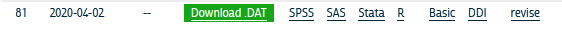

In this example we will use the [IPUMS USA](https://usa.ipums.org/usa/) data to produce survey-based estimates for various geographic levels present in the IPUMS. This example uses the 2014-2018 ACS 5-year microdata. 


```{r setup, include=FALSE}
knitr::opts_chunk$set(echo = TRUE)
```

The good folks at IPUMS have created a library to read in their data from the .gz file that you download. Be sure you right click and save the DDI codebook when you create your extract



This will save the xml file that contains all the information on the data (what is contained in the data file) to your computer. When using IPUMS, it will have a name like `usa_xxxxx.xml` where the x's represent the extract number (I'm on 92 as of today). 

You will also need to download the data file, by right clicking the **Download.DAT** link in the above image. This will save a .gz file to your computer, again with a name like: `usa_xxxxx.dat.gz`. Make sure this file and the xml file from above are in the same folder, preferably your class folder. 

Be sure the `ipumsr` package is installed. 

```{r}
library(ipumsr)
ddi <- read_ipums_ddi("C:/Users/ozd504//OneDrive - University of Texas at San Antonio//gis_classwork/usa_00083.xml")
data <- read_ipums_micro(ddi)
data<-haven::zap_labels(data) #necessary to avoid problems with "labelled" data class
names(data)<-tolower(names(data))
```

## Load some other packages
```{r, message=FALSE}
library(survey, quietly = T)
library(tidyverse, quietly = T)
library(car, quietly = T)
library(ggplot2, quietly = T)
library(tigris, quietly = T)
library(classInt, quietly = T)
library(tmap, quietly = T)

```


### Download geographic data for Public Use Microdata Areas
The Public Use Microdata Area is the lowest level of geography in the PUMS data. They correspond to greographic ares of ~ 100,000 people. 

```{r}
options(tigris_class = "sf")
pumas<-pumas(state = "TX",
             year = 2018,
             cb = T)


plot(pumas["GEOID10"],
     main = "Public Use Microdata Areas in Texas")


mapview::mapview(pumas, zcol= "GEOID10")
```


## Prepare variables
Here I recode several demographic variables

```{r}

data$pwt <- data$perwt
data$hwt <- data$hhwt

#race/ethnicity
data$hisp <- Recode(data$hispan, recodes = "9=NA; 1:4='Hispanic'; 0='NonHispanic'")
data$race_rec <- Recode(data$race, recodes = "1='White'; 2='Black'; 3='Other'; 4:6='Asian'; 7:9='Other'")
data$race_eth <- interaction(data$hisp, data$race_rec, sep = "_")
data$race_eth  <- as.factor(ifelse(substr(as.character(data$race_eth),1,8) == "Hispanic", "Hispanic", as.character(data$race_eth)))
data$race_eth <- relevel(data$race_eth, ref = "NonHispanic_White")

#sex
data$male <- ifelse(data$sex == 1,1,0)

#education
data$educ_level<- Recode(data$educd, recodes = "2:61='0LT_HS';62:64='1_HSD/GED';65:80='2_somecoll';90:100='2_somecoll'; 81:83='3_AssocDegree';101='4_bachelordegree'; 110:116='4_BAplus_GradDegree'; else=NA")

#employment
data$employed <- Recode(data$wrklstwk, recodes = "1=0;2=1; else=NA")

#citizenship
data$cit<-Recode(data$citizen, recodes = "1='US born'; 2='naturalized'; 3:4='notcitizen';else=NA ")

#industry
data$ind_group<-Recode(data$ind, recodes = "170:490='ag_extract'; 770='construction'; 1070:3990='manufac'; 4070:5790='whole_retail'; 6070:6390='trans'; 6470:6780='information'; 6870:7190= 'fire'; 7270=7790='prof/sci/manage'; 7860:8470='edu/social'; 8560:8690='arts'; 8770:9290='other'; 9370:9590='public_adm'; 9670:9870='military'; else=NA ")

data$proftech <- Recode(data$ind, recodes = "7270:7490=1; 0=NA; else=0")

#age in 10 year intervals
data$agecat<-cut(data$age, breaks = c(0, 18, 20, 30, 40, 50, 65, 120), include.lowest = T)

data$income <- ifelse(data$incwage>=999998, NA, data$incwage)
```


## Generate survey design object
Here we identify the person weights and the survey design variables.

```{r}
des<-svydesign(ids = ~cluster,
               strata = ~ strata,
               weights = ~pwt,
               data = data)
```

## perform survey estimation for PUMAs
The `svyby()` function allows us calculate estimates for different **sub-domains** within the data, this could be a demographic characteristic, but we'll use our geographic level. Of course you could do both.... 

```{r}
test<-svytable(~I(cit=="US born")+puma+sex, design=des )

puma_est_edu<-svyby(formula = ~educ_level,
                    by = ~puma,
                    design = subset(des, age>25),
                    FUN=svymean,
                    na.rm = TRUE )

puma_est_employ<-svyby(formula = ~employed,
                       by = ~puma,
                       design=subset(des, age %in% 18:65),
                       FUN=svymean,
                       na.rm = TRUE )

puma_est_industry<-svyby(formula = ~proftech,
                         by = ~puma+sex+race_eth,
                         design = subset(des, employed==1),
                         FUN = svymean,
                         na.rm = TRUE )
```


```{r}
library(reldist)
gini.puma<-data%>%
  filter(income >0, is.na(income)==F)%>%
  group_by( puma, race_eth)%>%
  summarize(ineq = gini(income, weights = pwt))%>%
  ungroup()
```


```{r}
head(puma_est_edu)
head(puma_est_employ)
head(puma_est_industry)
```

## join to geography

```{r}
pumas$puma<-as.numeric(pumas$PUMACE10)

geo1<-left_join(pumas, puma_est_employ, by=c("puma"= "puma"))
head(geo1)

geo2<-left_join(pumas, puma_est_industry, by=c("puma"= "puma"))
head(geo2)

geo3<-left_join(pumas, gini.puma, by=c("puma"= "puma"))
head(geo2)

```

## Map estimates

### Employment rates by PUMA
```{r}

tmap_mode("view")

geo1%>%
  tm_shape()+
  tm_polygons("employed",
              style="kmeans",
              n=8,
              legend.hist = TRUE) +
  tm_layout(legend.outside = TRUE,
            title = "Employment rate in Texas PUMAs \n 2014-2018") 


```

```{r}
#tmap_mode("plot")
geo2%>%
  tm_shape()+
  tm_polygons("proftech",
              style="kmeans",
              n=8,
              legend.hist = TRUE) +
 tm_layout(legend.outside = TRUE,
            title = "Employment rate in Texas PUMAs \n 2014-2018")  

```

```{r}
  
geo3%>%
tm_shape()+
  tm_polygons("ineq",
              style="kmeans",
              n=8,
              legend.hist = TRUE) +
 tm_layout(legend.outside = TRUE,
            title = "Employment rate in Texas PUMAs \n 2014-2018")  

```


## Estimation for metro areas
Here we use core based statistical areas instead of PUMAs

```{r, results='hide'}
mets<-core_based_statistical_areas(cb = T, year = 2018)
mets<-mets[grep(mets$NAME,pattern =  "TX"),]
plot(mets["NAME"])

sts<-states(cb=T, year=2018)
sts<-sts%>%
  filter(GEOID==48)
```
## estimates by metro area
```{r}
met_est_edu<-svyby(formula = ~educ_level,
                   by = ~met2013,
                   design=subset(des,age>25),
                   FUN=svymean,
                   na.rm=T )

met_est_employ<-svyby(formula = ~employed,
                      by = ~met2013,
                      design=subset(des, age%in%18:65),
                      FUN=svymean,
                      na.rm=T )

met_est_industry<-svyby(formula = ~proftech,
                        by = ~met2013,
                        design=subset(des, employed==1),
                        FUN=svymean,
                        na.rm=T )

head(met_est_edu)
head(met_est_employ)
head(met_est_industry)

```


```{r}
mets$met2013<-as.numeric(mets$GEOID)
geo3<-left_join(mets, met_est_employ,by=c("met2013"= "met2013"))

```

Note, grey Metros are ones that are not identified in the ACS
```{r}
tmap_mode("view")

geo3%>%
  tm_shape()+
  tm_polygons("employed",
              style="kmeans",
              n=8,
              legend.hist = TRUE) +
 tm_layout(legend.outside = TRUE,
            title = "Employment rate in Texas Metro Areas \n 2014-2018")  

```


## Estimation for Counties
## 
```{r, results='hide'}
cos<-counties(cb= T,state = "TX", year = 2018)
plot(cos["NAME"])

sts<-states(cb=T, year=2018)
sts<-sts%>%
  filter(GEOID==48)
```
## estimates by county area
```{r}
cos_est_edu<-svyby(formula = ~educ_level,
                   by = ~countyfip,
                   design=subset(des,age>25),
                   FUN=svymean, na.rm=T )
cos_est_employ<-svyby(formula = ~employed,
                      by = ~countyfip,
                      design=subset(des, age%in%18:65),
                      FUN=svymean, na.rm=T )
cos_est_industry<-svyby(formula = ~proftech,
                        by = ~countyfip,
                        design=subset(des, employed==1),
                        FUN=svymean, na.rm=T )

head(cos_est_edu)
head(cos_est_employ)
head(cos_est_industry)

```
Again, the ACS doesn't identify counties in the microdata except for those counties with small populations. The list of identified counties can be found [here](https://usa.ipums.org/usa-action/variables/COUNTYFIP#codes_section)

```{r}
cos$cofip<-as.numeric(cos$COUNTYFP)


geo4<-left_join(cos, cos_est_employ,by=c("cofip"= "countyfip"))

tmap_mode("view")

geo4%>%
  tm_shape()+
  tm_polygons("employed",
              style="kmeans",
              n=8,
              legend.hist = TRUE) +
 tm_layout(legend.outside = TRUE,
            title = "Employment rate in Texas Counties \n 2014-2018")  

```


